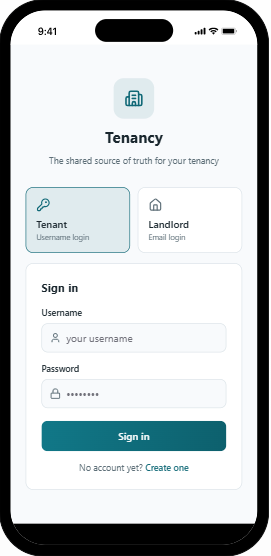
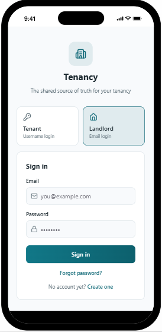
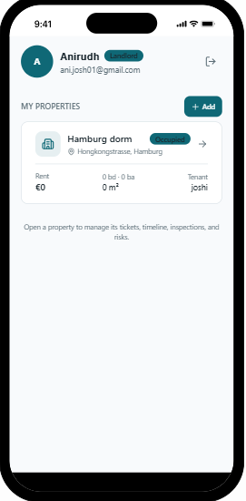
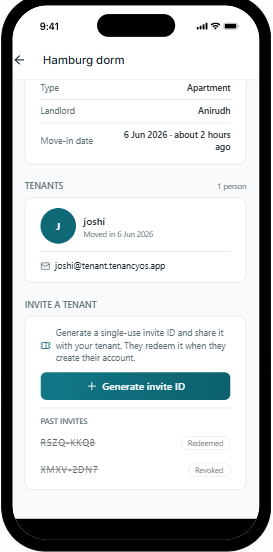
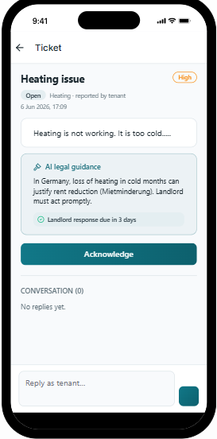
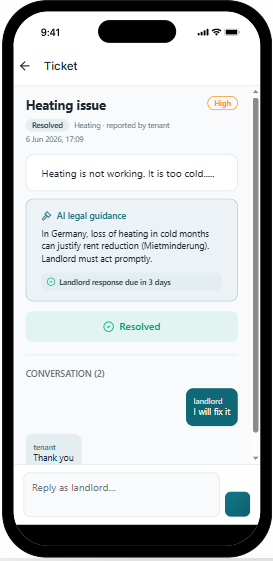
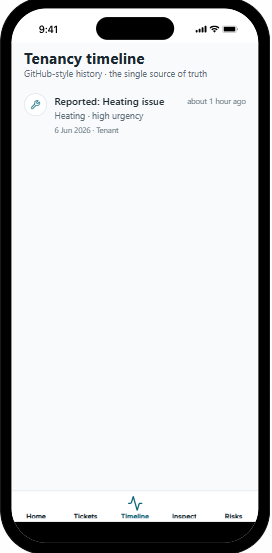
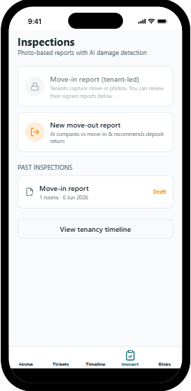
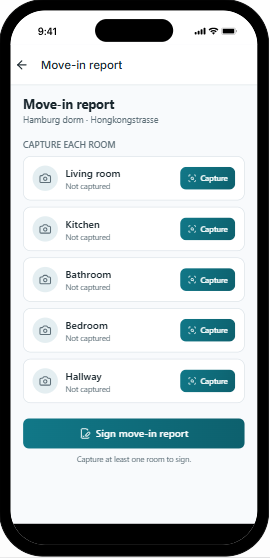

# ClearLease

[](https://bilt.me)

## Project info

**Preview URL**: https://app.bilt.me/project/1565044b-65fb-42da-96e7-06aa10efeeed/preview

**Project ID**: `1565044b-65fb-42da-96e7-06aa10efeeed`

## About

ClearLease is a mobile tenancy management app built for the Founder Hackathon. It gives landlords and tenants a shared, auditable record of everything that happens during a lease — maintenance tickets, inspections, timeline events, and AI-powered risk signals — so disputes are easier to prevent and resolve.

Landlords manage a portfolio of properties, invite tenants with single-use codes, and drive ticket workflows. Tenants report issues, capture move-in photos, and follow the same timeline their landlord sees.

## Features

### For landlords

- **Portfolio dashboard** — view all properties, rent, occupancy, and tenant summaries in one place
- **Property management** — add units, track layout and financials, and open a property workspace
- **Invite-only tenant onboarding** — generate single-use invite IDs; tenants redeem them at signup
- **Ticket workflow** — acknowledge, start work, and mark issues resolved with a threaded conversation
- **AI legal guidance** — suggested response timelines for maintenance issues (e.g. German *Mietminderung* rules)
- **Inspections** — review tenant move-in reports and start move-out reports with deposit recommendations
- **Tenancy timeline** — GitHub-style event history as the single source of truth
- **Risk prediction** — AI flags moisture, deposit, maintenance, and legal risks early

### For tenants

- **Username-based login** — sign in with the credentials created during invite redemption
- **Issue reporting** — submit tickets with AI triage for urgency, category, and legal notes
- **Move-in documentation** — photo-based room capture with AI damage detection before signing
- **Shared timeline** — every report and reply is logged and visible to both parties
- **Conversation** — reply on tickets without changing landlord-only workflow status

## Screenshots

Screens are shown in the order a user typically flows through the app: sign in → landlord setup → day-to-day tenancy management.

### 1. Sign in — Tenant

Tenants log in with a username and password created when they redeem a landlord invite.



### 2. Sign in — Landlord

Landlords log in with email and password and land on their property portfolio.



### 3. Landlord portfolio

The **My Properties** screen lists every unit with rent, size, occupancy status, and current tenant.



### 4. Property details & tenant invites

Landlords view property metadata, linked tenants, and generate or revoke single-use invite IDs.



### 5. Maintenance ticket — open

Tenants report issues with AI legal guidance and a response deadline. Status actions are landlord-only.



### 6. Maintenance ticket — resolved

Landlords manage the full workflow and converse with tenants until the ticket is marked resolved.



### 7. Tenancy timeline

Every ticket, inspection, and key event is appended to a shared, chronological history.



### 8. Inspections

Move-in reports are tenant-led; landlords review signed reports and can start move-out inspections with deposit recommendations.



### 9. Move-in report

Tenants capture each room with AI damage detection, then sign the report to lock in pre-existing condition.



## Tech stack

- **React Native** + **Expo** (SDK 54)
- **TypeScript**
- **Expo Router** — file-based navigation with role-aware auth guards
- **NativeWind** — Tailwind-style styling
- **Zustand** — client state and persistence
- **Supabase** — auth, property data, invite-only tenant signup, and RLS
- **React Hook Form** + **Zod** — form validation

## Getting started

### Preview (recommended)

Open the preview URL in your browser or scan the QR code with [Expo Go](https://expo.dev/go) on your phone:

```
https://app.bilt.me/project/1565044b-65fb-42da-96e7-06aa10efeeed/preview
```

### Run locally

```sh
npm install
npx expo start
```

Then press `w` for web, or scan the QR code with Expo Go.

## Supabase setup

Tenant accounts are invite-only. A landlord opens a property, generates a single-use invite ID, and shares it with the tenant. The tenant signs up with that ID plus a username and password; redemption links their profile to that property only.

Apply the migration in `supabase/migrations/20260606170000_invite_tenant_signup.sql` to create the `property_invites` table, invite preview/redemption RPCs, tenant property linking, and property-scoped RLS policies.

## Deploy

Go to your [Bilt project](https://app.bilt.me/agent/1565044b-65fb-42da-96e7-06aa10efeeed), then **Settings → App Store**.

To trigger a production build from chat, send: *"Deploy this app to production"*

## Making changes

Visit your [Bilt project](https://app.bilt.me/agent/1565044b-65fb-42da-96e7-06aa10efeeed) and describe changes in natural language — Bilt updates the codebase automatically.

For local development, edit files under `app/`, `components/`, and `lib/`, then run `npx expo start` to preview.
